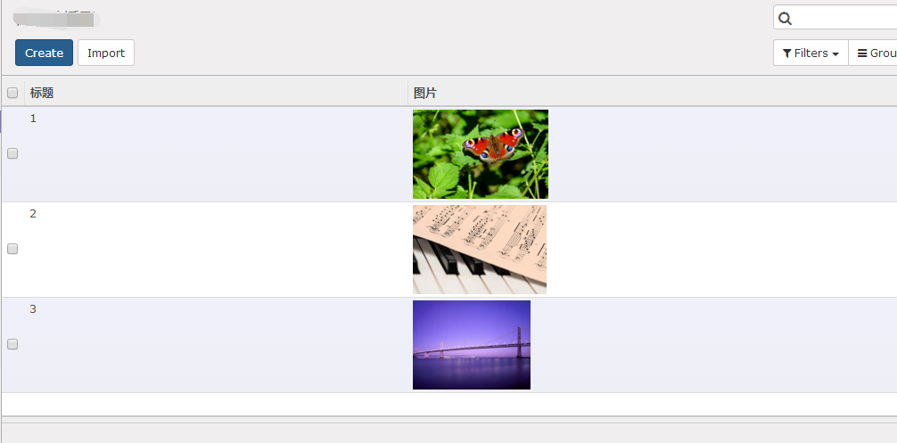

# web_tree_image_preview
odoo9 tree view image preview addon

How to use:

Model:
```img = fields.Binary(attachment=True)```


View:
```<field name="img" widget="image-preview"/>```

Screenshot:



